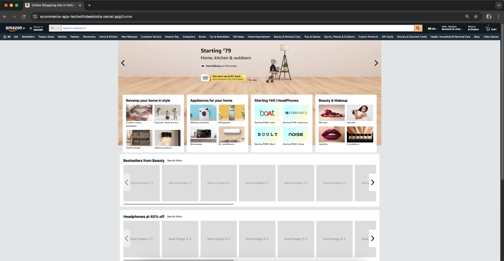
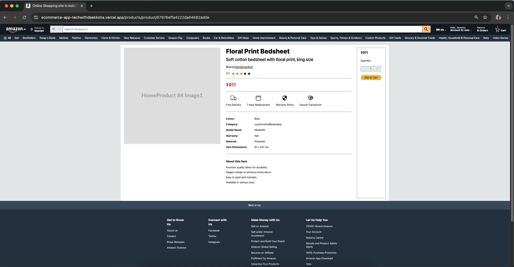
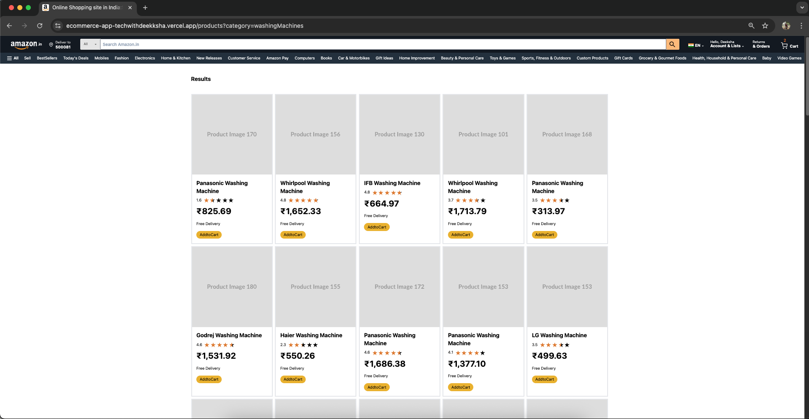
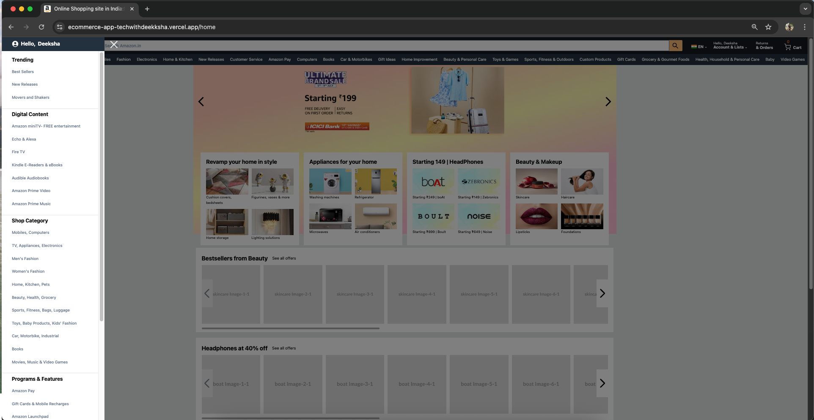
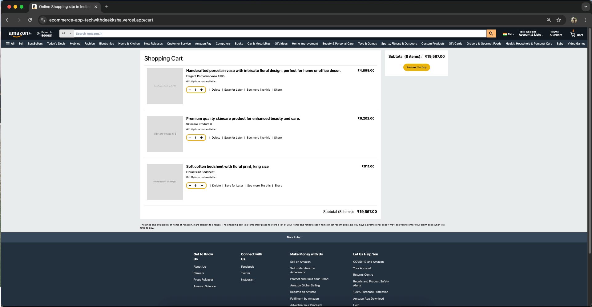

# Ecommerce-App (Amazon Inspired)
[](https://github.com/404notDeeksha/Ecommerce-App/blob/main/License)

A responsive e-commerce web application inspired by Amazon. It allows users to browse and filter products, manage their cart, and securely log in to access personalized features.

Deployed and ready to help you make shopping fun!

<br/>

## 🔗 Live Demo

Frontend: [https://ecommerce-app-techwithdeekksha.vercel.app](https://ecommerce-app-techwithdeekksha.vercel.app)  
Backend: [https://ecommerce-dep-techwithdeekksha.vercel.app](https://ecommerce-dep-techwithdeekksha.vercel.app/api/test)

<br/>

## 🎬 Quick Demo


## 📂 Backend Repository
[](https://github.com/404notDeeksha/Ecommerce-App-Backend)


</br>

## 🚀 Tech Stack

[](https://reactjs.org/)
[](https://vitejs.dev/)
[](https://tailwindcss.com/)
[](https://redux-toolkit.js.org/)
[](https://vercel.com/)

<br/>

## ✨ Features

- 🛒 **Cart System** – Add, update, and remove items from the cart
- 🔍 **Product Filtering** – Browse by categories & sub categories
- 📱 **Responsive Design** – Looks great on all devices
- ⚡️ **Vite Powered** – Fast development and optimized builds
- 🧼 **Clean UI** – Minimal, elegant, and user-focused
- 🔐 **Secure Backend** – CORS configured and ready for integration

<br/>

## 🖼️ Screenshots

| 🏠 Home Page                        | 🧾 Product Page                          |
| ----------------------------------- | ---------------------------------------- |
|  |  |

| 🗂️ Products Grid Page                         | 📚 Sidebar Modal                          |
| --------------------------------------------- | ----------------------------------------- |
|  |  |

| 🛒 Cart Page |
| ------------ |
|  |


<br/>

## 🚀 Getting Started

To run this project locally:

```bash
# 1. Clone the repo
git clone https://github.com/404notDeeksha/Ecommerce-App.git

# 2. Navigate to the project folder
cd Ecommerce-App

# 3. Install dependencies
npm install

# 4. Start the dev server
npm run dev
```

## 🎓 What I Built & Learned

- State management with Redux Toolkit
- Implemented server-to-client integration by configuring CORS for secure API communication.
- RESTful API integration
- Responsive design principles
- Full-stack deployment on Vercel

## 🚀 Upcoming Features

- Integration of additional product filters (e.g., brands, prices, discounts etc.)
- Automated tests for CI/CD pipeline (in development)

## 📄 License

This project is licensed under the MIT License - see the [LICENSE](/LICENSE.md) file for details.

## 👋 Connect With Me

- Email: deeksha14.developer@gmail.com
- GitHub: [@404notDeeksha](https://github.com/404notDeeksha)
- LinkedIn: [My LinkedIn Profile](https://www.linkedin.com/in/deek1995)