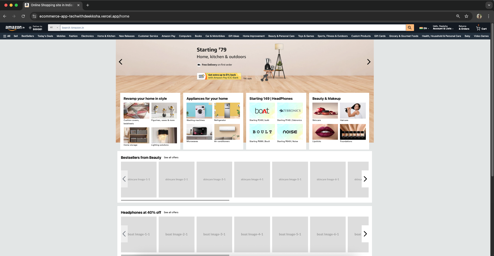
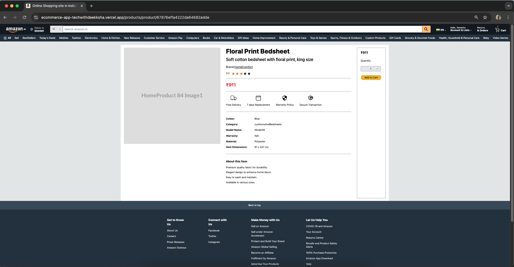
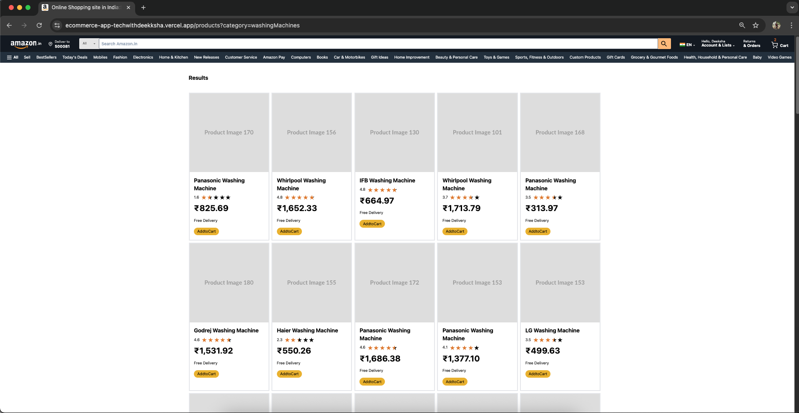
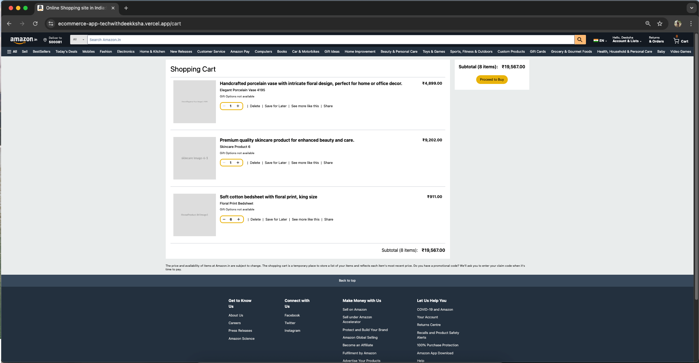

# 🛒 Ecommerce-App

[](https://github.com/404notDeeksha/Ecommerce-App/blob/main/License)
[](https://vercel.com/new/clone?repository-url=https://github.com/404notDeeksha/Ecommerce-App)


> A production-ready e-commerce frontend with cart management, JWT authentication, and real-time state persistence — inspired by Amazon's UX patterns.

**[Live Demo](https://ecommerceapp-demo.vercel.app)** • **[Backend Repo](https://github.com/404notDeeksha/Ecommerce-App-Backend)**

---

## 🎯 Key Highlights

- ✅ **Full cart lifecycle** — Add, update, remove items with Redux Toolkit + persistence across sessions
- ✅ **JWT authentication flow** — Protected routes, secure login/signup with token refresh
- ✅ **Mobile-first responsive** — Tailwind CSS, works seamlessly on mobile/tablet/desktop
- ✅ **Production-ready DX** — Vite builds, Vitest testing, ESLint, CI/CD on Vercel
- ✅ **Polished UX** — Framer Motion animations, toast notifications, error boundaries, skeleton loaders

---

## 🖼️ Screenshots

| Home Page | Product Page |
|----------|--------------|
|  |  |

| Products Grid | Cart |
|--------------|------|
|  |  |

---

## ⚡ Tech Stack

| Category | Technologies |
|----------|-------------|
| **Frontend** | React 18 + Vite |
| **Styling** | Tailwind CSS + MUI |
| **State** | Redux Toolkit + Redux Persist |
| **Routing** | React Router v6 |
| **API** | Axios with interceptors |
| **Animation** | Framer Motion |
| **Testing** | Vitest + React Testing Library |
| **Deployment** | Vercel (CI/CD) |

---

## 📊 Performance & Engineering

- ⚡ **Vite-powered builds** — Sub-second dev server startup, optimized production bundles
- 🧪 **Tested with Vitest** — Unit & integration tests for critical flows
- 💾 **State persistence** — Auth & cart survive page refreshes via Redux Persist (localStorage)
- 🛡️ **Error resilience** — React Error Boundaries prevent full app crashes
- 🔐 **Route protection** — Guarded routes check auth state before rendering protected pages

<details>
<summary><strong>Click to expand — Deep Dive</strong></summary>

---

## 🏗️ Architecture & Engineering Decisions

### State Management
- **Redux Toolkit** with slices pattern for cart, auth, errors, and UI state
- **Redux Persist** serializes state to localStorage — cart and auth survive refresh

### API Layer
- **Axios** with centralized interceptors for auth token injection
- Dedicated `api/` module with endpoint definitions and error transformation

### Authentication Flow
- JWT-based login/signup with protected routes
- Token stored via Redux state, auto-attached to API requests
- `ProtectedRoute.jsx` guards prevent unauthorized access

### UI/UX Engineering
- **Framer Motion** for smooth page transitions and micro-interactions
- **Mobile-first** Tailwind classes for responsive layouts
- Toast notifications provide real-time feedback
- Skeleton loaders eliminate layout shift during data fetches

### Testing Strategy
- **Vitest** for fast unit tests
- **React Testing Library** for component integration tests
- Focused on critical paths: cart operations, auth flow, routing

---

## 🚧 Challenges Solved

| Challenge | Solution |
|-----------|----------|
| **State loss on refresh** | Redux Persist persists cart + auth in localStorage |
| **Protected route bypass** | `ProtectedRoute.jsx` enforces auth checks before render |
| **UI flickering** | Skeleton loaders + error boundaries + toast feedback |
| **API error inconsistency** | Centralized error slice normalizes all API failures |

---

## 📂 Project Structure

```
src/
├── api/               # Axios setup + endpoint definitions
├── components/       # Reusable UI components
│   ├── common/       # Loader, Portal, etc.
│   ├── feedback/     # Toasts, error boundaries
│   └── layout/       # Header, Footer, Sidebar
├── config/           # App configuration
├── hooks/            # Custom React hooks
├── pages/
│   ├── Auth/         # Login, Signup
│   ├── CartPage/     # Shopping cart
│   ├── HomePage/     # Landing
│   └── ProductsPage/ # Product listing
├── redux/
│   └── slices/       # auth, cart, error, loader
├── routes/           # Route definitions
├── styles/           # Global styles
└── utils/            # Helpers
```

---

## 🚀 Getting Started

```bash
# Clone
git clone https://github.com/404notDeeksha/Ecommerce-App.git

# Install
npm install

# Dev server
npm run dev
```

### Environment Variables

Create `.env` based on `.env.example`:

```bash
# Development
VITE_BASE_URL=http://localhost:8000/api

# Production  
VITE_BASE_URL=https://your-backend.vercel.app/api
```

### Available Scripts

| Command | Description |
|---------|-------------|
| `npm run dev` | Start dev server |
| `npm run build` | Production build |
| `npm run lint` | Run ESLint |
| `npm run preview` | Preview build |
| `npm run test` | Run tests (watch) |
| `npm run test:run` | Run tests once |

---

## 🔮 Upcoming Features

- [ ] Brand/price filters
- [ ] Checkout + payment integration
- [ ] Order history & tracking
- [ ] Product reviews & ratings
- [ ] Wishlist
- [ ] i18n (Redux slice ready)

---

## 📄 License

MIT — see [LICENSE](./LICENSE.md)

## 👤 Connect

- [GitHub](https://github.com/404notDeeksha) • [LinkedIn](https://www.linkedin.com/in/deek1995) • deeksha.developer@proton.me

</details>

---

*Built with React, Tailwind CSS & Vite — deployed on Vercel*
