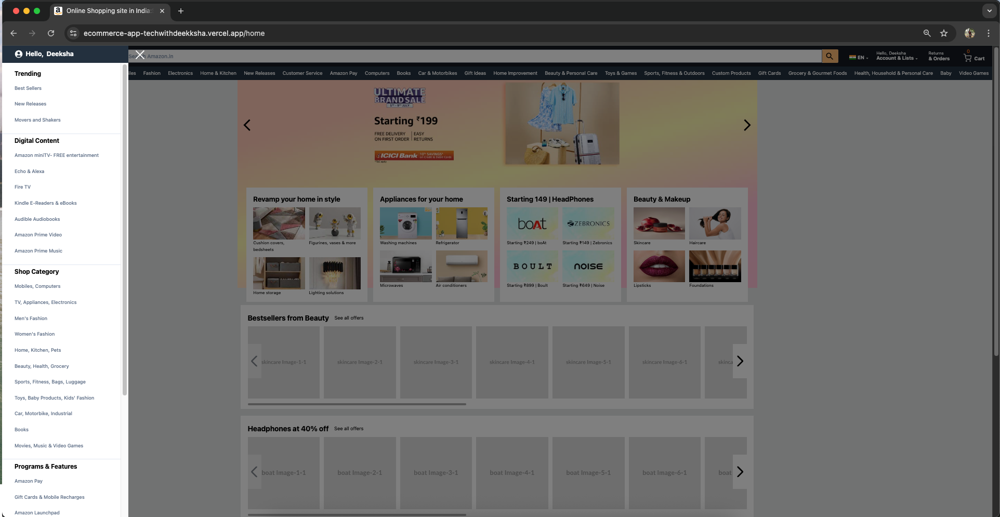

# Ecommerce-App (Amazon Inspired)


[](https://github.com/404notDeeksha/Ecommerce-App/blob/main/License)
[](https://github.com/404notDeeksha/Ecommerce-App/pulls)
[](https://vercel.com/new/clone?repository-url=https://github.com/404notDeeksha/Ecommerce-App)

A responsive e-commerce web application inspired by Amazon. It allows users to browse and filter products, manage their cart, and securely log in to access personalized features.

> ⚡ Built with React, Vite, TailwindCSS & Redux Toolkit — deployed on Vercel

## 📋 Table of Contents

- [Live Demo](#-live-demo)
- [Tech Stack](#-tech-stack)
- [Features](#-features)
- [Screenshots](#-screenshots)
- [Getting Started](#-getting-started)
- [Environment Setup](#-environment-setup)
- [Available Scripts](#-available-scripts)
- [Project Structure](#-project-structure)
- [What I Built & Learned](#-what-i-built--learned)
- [Upcoming Features](#-upcoming-features)
- [Contributing](#-contributing)
- [FAQ](#-faq)
- [License](#-license)
- [Connect With Me](#--connect-with-me)

---

## 🔗 Live Demo

Frontend: [https://ecommerceapp-demo.vercel.app](https://ecommerceapp-demo.vercel.app)  
Backend: [https://ecommerce-dep-techwithdeekksha.vercel.app](https://ecommerce-dep-techwithdeekksha.vercel.app/api/test)

<br/>

## 🎬 Quick Demo


## 📂 Backend Repository
[](https://github.com/404notDeeksha/Ecommerce-App-Backend)


</br>

## 🚀 Tech Stack

[](https://reactjs.org/)
[](https://vitejs.dev/)
[](https://tailwindcss.com/)
[](https://redux-toolkit.js.org/)
[](https://vercel.com/)
[](https://reactrouter.com/)
[](https://mui.com/)
[](https://www.framer.com/motion/)
[](https://axios-http.com/)
[](https://vitest.dev/)

<br/>

## ✨ Features

- 🛒 **Cart System** – Add, update, and remove items from the cart
- 🔍 **Product Filtering** – Browse by categories & sub categories
- 👤 **User Authentication** – Secure login and signup with JWT
- 📱 **Responsive Design** – Looks great on all devices
- ⚡️ **Vite Powered** – Fast development and optimized builds
- 🧼 **Clean UI** – Minimal, elegant, and user-focused
- 🔐 **Secure Backend** – CORS configured and ready for integration
- 🚨 **Error Boundaries** – Graceful error handling with fallbacks
- 🔔 **Toast Notifications** – Real-time feedback to users
- 📦 **State Persistence** – Redux Persist keeps auth state across sessions
- ✨ **Animations** – Smooth transitions with Framer Motion
- 🧪 **Tested** – Vitest for unit and integration tests

<br/>

## 🖼️ Screenshots

| 🏠 Home Page                        | 🧾 Product Page                          |
| ----------------------------------- | ---------------------------------------- |
|  |  |

| 🗂️ Products Grid Page                         | 📚 Sidebar Modal                          |
| --------------------------------------------- | ----------------------------------------- |
|  |  |

| 🛒 Cart Page |
| ------------ |
|  |


<br/>

## 🚀 Getting Started

To run this project locally:

```bash
# 1. Clone the repo
git clone https://github.com/404notDeeksha/Ecommerce-App.git

# 2. Navigate to the project folder
cd Ecommerce-App

# 3. Install dependencies
npm install

# 4. Start the dev server
npm run dev
```

## 🔧 Environment Setup

Create a `.env` file based on `.env.example`:

```bash
# Development
VITE_BASE_URL=http://localhost:8000/api

# Production
VITE_BASE_URL=https://your-backend.vercel.app/api
```

## 📜 Available Scripts

| Command | Description |
|---------|-------------|
| `npm run dev` | Start development server |
| `npm run build` | Build for production |
| `npm run lint` | Run ESLint |
| `npm run preview` | Preview production build |
| `npm run test` | Run tests (watch mode) |
| `npm run test:run` | Run tests once |

## 🏗️ Project Structure

```
src/
├── api/           # API endpoints & axios setup
├── components/    # Reusable UI components
│   ├── common/    # Generic components (Loader, Portal, etc.)
│   ├── feedback/ # Toasts, notifications
│   └── layout/    # Header, Footer, Sidebar
├── config/        # App configuration
├── hooks/         # Custom React hooks
├── pages/         # Page components
│   ├── Auth/      # Login, Signup
│   ├── CartPage/  # Shopping cart
│   ├── HomePage/  # Landing page
│   └── ProductsPage/ # Product listing
├── redux/         # State management
│   └── slices/    # auth, cart, error, loader, etc.
├── routes/        # Route definitions
├── styles/        # Global styles
└── utils/         # Helper functions
```

## 🎓 What I Built & Learned

- **State Management** – Redux Toolkit with slices pattern for cart, auth, errors, and UI state
- **Server Integration** – Axios client with interceptors for API communication
- **Error Handling** – React Error Boundary for graceful failure recovery
- **Responsive Design** – Mobile-first approach with Tailwind CSS
- **Authentication Flow** – JWT-based login/signup with protected routes
- **Performance** – Vite-powered fast builds with code splitting
- **Testing** – Unit tests with Vitest and React Testing Library
- **Deployment** – CI/CD pipeline on Vercel with environment configuration

## 🚀 Upcoming Features

- [ ] Cart state persistence (save cart across sessions)
- [ ] Additional product filters (brands, price range, discounts)
- [ ] Checkout flow with payment integration
- [ ] Order history and tracking
- [ ] Product reviews and ratings
- [ ] Wishlist functionality
- [ ] Expanded test coverage for CI/CD
- [ ] 🌐 **i18n (Multi-language support)** – Redux slice ready, UI integration in progress

## 🤝 Contributing

Contributions are welcome! Please feel free to submit a Pull Request.

1. Fork the repository
2. Create your feature branch (`git checkout -b feature/AmazingFeature`)
3. Commit your changes (`git commit -m 'Add some AmazingFeature'`)
4. Push to the branch (`git push origin feature/AmazingFeature`)
5. Open a Pull Request

## ❓ FAQ

**Q: What is the backend API URL?**  
A: Set `VITE_BASE_URL` in your `.env` file. In development, use `http://localhost:8000/api`.

**Q: How do I run tests?**  
A: Run `npm run test` for watch mode or `npm run test:run` for a single run.

**Q: Why isn't my cart data persisting?**  
A: Currently, only auth state is persisted via Redux Persist. Cart data resets on page reload (see Upcoming Features).

## 🐛 Troubleshooting

| Issue | Solution |
|-------|----------|
| CORS errors | Ensure backend has correct CORS configuration for your frontend URL |
| API not connecting | Check `VITE_BASE_URL` in `.env` matches your backend URL |
| Build fails | Run `npm install` to ensure all dependencies are installed |
| Tests failing | Ensure test dependencies (`vitest`, `@testing-library/*`) are installed |

## 📄 License

This project is licensed under the MIT License - see the [LICENSE](/LICENSE.md) file for details.

## 👋 Connect With Me

- Email: deeksha.developer@proton.me
- GitHub: [@404notDeeksha](https://github.com/404notDeeksha)
- LinkedIn: [My LinkedIn Profile](https://www.linkedin.com/in/deek1995)
